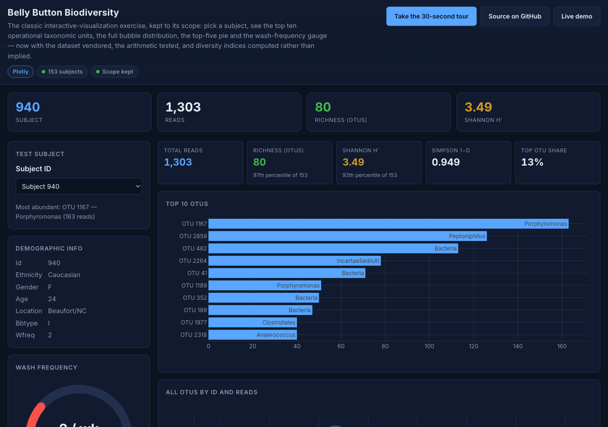
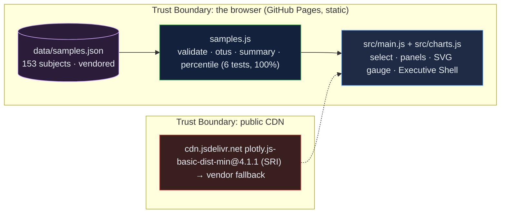

# Belly Button Biodiversity: the interactive-visualization exercise, kept to scope, with its data vendored and its arithmetic tested

[](https://github.com/Freddricklogan/belly-button-challenge/actions/workflows/deploy.yml)
[](#5-getting-started--verification)
[](https://github.com/Freddricklogan/belly-button-challenge/actions/workflows/codeql.yml)
[](LICENSE)
[](https://freddricklogan.github.io/belly-button-challenge/)

## 1. Executive Summary & Business Impact

**Problem statement.** The Belly Button Biodiversity dashboard is a
standard data-visualization exercise: pick a subject, see their
microbial OTUs. The previous build loaded its data from a course
provider's S3 bucket on every visit, loaded an unpinned
`plotly-latest` and D3 for one line of DOM work, assumed the arrays
arrived sorted, compared ids with `==`, and fixed the bubble chart at
1,000 pixels wide (`AUDIT.md`).

**Solution & value delivered.** The same four panels — top-ten bar,
bubble chart, top-five pie, wash-frequency gauge — with the 153-subject
dataset vendored and validated, Plotly's basic bundle pinned with an
integrity hash and a vendored fallback, the gauge drawn as SVG, OTUs
sorted before slicing, and per-sample statistics that the original
only implied: total reads, richness, Shannon and Simpson indices, and
the top OTU's share, each placed as a percentile of the cohort. Scope
kept; dependencies and correctness fixed.

**[→ Read the full case study](docs/CASE_STUDY.md)**



## 2. Demonstrated Competencies & Technical Skills

- **Data Visualization** — Plotly bar, bubble and pie with hover
  templates; an SVG gauge; responsive layouts; dark-theme styling.
- **Data Science** — Shannon and Simpson diversity indices, richness,
  dominance, cohort percentiles, tested against hand values.
- **Engineering Practice** — vendored and validated data, pinned
  dependencies with SRI, strict CSP with one documented hash exception,
  100 % statement coverage of the logic module.

## 3. System Architecture & Data Flow



## 4. Technical Highlights & Engineering Decisions

### ADR-1 — Vendor the dataset

**Context.** The page fetched its only data from a third-party bucket
the author does not control.

**Decision.** `data/samples.json` is committed with its provenance
printed on the page, and `validateDataset` checks array alignment and
value ranges on load.

**Consequence.** The demo cannot go blank when a course provider
reorganises a bucket, and a broken export is reported rather than
rendered.

### ADR-2 — Basic Plotly bundle plus an SVG gauge

**Context.** The full Plotly bundle was loaded, unpinned, mainly for
the indicator trace behind one gauge.

**Decision.** Pin `plotly.js-basic-dist-min@4.1.1` with an SRI hash and
a vendored copy; draw the gauge as two SVG arcs and a label.

**Consequence.** A pinned, verifiable dependency, and a strict CSP
whose only exception is the SHA-256 of the empty string that Plotly's
style injection needs.

### ADR-3 — Compute the indices the chart implies

**Context.** "Top ten" was a slice of unsorted input and diversity was a
matter of looking at the bubble chart.

**Decision.** Sort OTUs by reads before slicing; compute reads,
richness, Shannon, Simpson and top share per sample with tests against
hand values; show richness and Shannon as cohort percentiles.

**Consequence.** Subject 940 reads as 80 OTUs at the 97th percentile of
153 rather than as "a lot of bubbles".

## 5. Getting Started & Verification

**Prerequisites.** Node 22 LTS. No build step; the page is served from
the repository root.

```bash
git clone https://github.com/Freddricklogan/belly-button-challenge.git
cd belly-button-challenge
npm ci
npm run lint && npm run validate && npm run coverage
npx serve .    # open http://localhost:3000
```

**Verification — the numbers this repository actually produced:**

```bash
npm run coverage   # 6 passed / 6; All files 100% stmts, 98.3% branches
npm run lint       # 0 problems
npm run validate   # html-validate index.html: clean
```

| Check | Result |
| --- | --- |
| Unit tests (Vitest) | **6 passed / 6** |
| Coverage (logic module) | **100%** statements, **98.3%** branches (`main.js`, `charts.js`, `ui.js` covered by the browser smoke test) |
| ESLint, html-validate | clean |
| Dataset | 153 subjects, validator reports 0 problems; subject 940: 80 OTUs, 1,303 reads, top OTU 1167 (Porphyromonas, 163 reads) |
| Headless Chrome smoke | **0 console errors**; subject 940 → reads 1,303, richness 80 (97th percentile), Shannon 3.49, Simpson 0.949, top share 13 %; three Plotly panels rendered; gauge 2 / wk; switching to 941 → 1,027 reads, 44 OTUs, gauge 1 / wk; three tour steps; no horizontal scroll at 1280 or 400 px |

## 6. Live Demo & Production Showcase

**<https://freddricklogan.github.io/belly-button-challenge/>**

**30-second guided walkthrough.** Press **Take the 30-second tour**: it
explains the indices, the sorted top ten, and the SVG gauge, then
switches subject. Pick any of the 153 subjects from the list.
